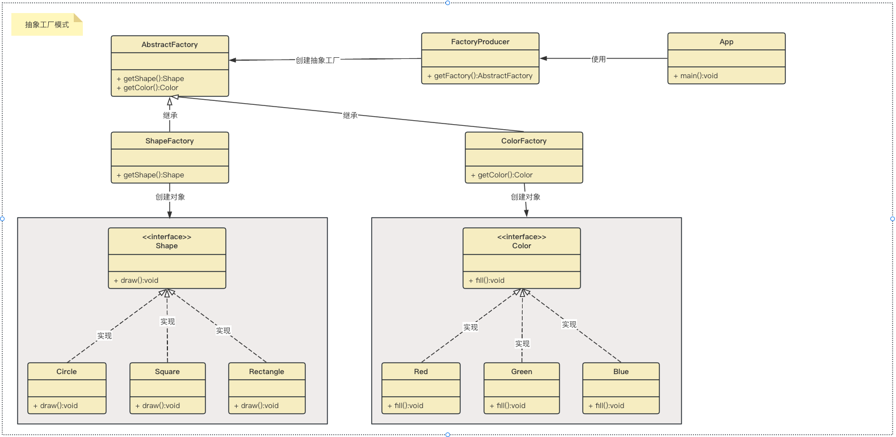

## 抽象工厂模式

### 意图
提供一个创建一系列相关或相互依赖对象的接口，而无需指定它们具体的类。

### 主要解决
主要解决接口选择的问题。

### 何时使用
系统的产品有多于一个的产品族，而系统只消费其中某一族的产品。

### 如何解决
在一个产品族里面，定义多个产品。

### 关键代码
在一个工厂里聚合多个同类产品。

### 应用实例
工作了，为了参加一些聚会，肯定有两套或多套衣服吧，比如说有商务装（成套，一系列具体产品）、时尚装（成套，一系列具体产品），甚至对于一个家庭来说，可能有商务女装、商务男装、时尚女装、时尚男装，这些也都是成套的，即一系列具体产品。假设一种情况（现实中是不存在的，但有利于说明抽象工厂模式），在您的家中，某一个衣柜（具体工厂）只能存放某一种这样的衣服（成套，一系列具体产品），每次拿这种成套的衣服时也自然要从这个衣柜中取出了。用 OOP 的思想去理解，所有的衣柜（具体工厂）都是衣柜类的（抽象工厂）某一个，而每一件成套的衣服又包括具体的上衣（某一具体产品），裤子（某一具体产品），这些具体的上衣其实也都是上衣（抽象产品），具体的裤子也都是裤子（另一个抽象产品）。

### 优点
当一个产品族中的多个对象被设计成一起工作时，它能保证客户端始终只使用同一个产品族中的对象。

### 缺点
产品族扩展非常困难，要增加一个系列的某一产品，既要在抽象的 Creator 里加代码，又要在具体的里面加代码。

### 使用场景
1. QQ 换皮肤，一整套一起换。 
2. 生成不同操作系统的程序。

### 注意事项
产品族难扩展，产品等级易扩展。

### 抽象工厂模式包含以下几个核心角色：
1. 抽象工厂（Abstract Factory）：声明了一组用于创建产品对象的方法，每个方法对应一种产品类型。抽象工厂可以是接口或抽象类。
2. 具体工厂（Concrete Factory）：实现了抽象工厂接口，负责创建具体产品对象的实例。
3. 抽象产品（Abstract Product）：定义了一组产品对象的共同接口或抽象类，描述了产品对象的公共方法。
4. 具体产品（Concrete Product）：实现了抽象产品接口，定义了具体产品的特定行为和属性。
抽象工厂模式通常涉及一族相关的产品，每个具体工厂类负责创建该族中的具体产品。客户端通过使用抽象工厂接口来创建产品对象，而不需要直接使用具体产品的实现类

### 示例图：

### 框架源码
