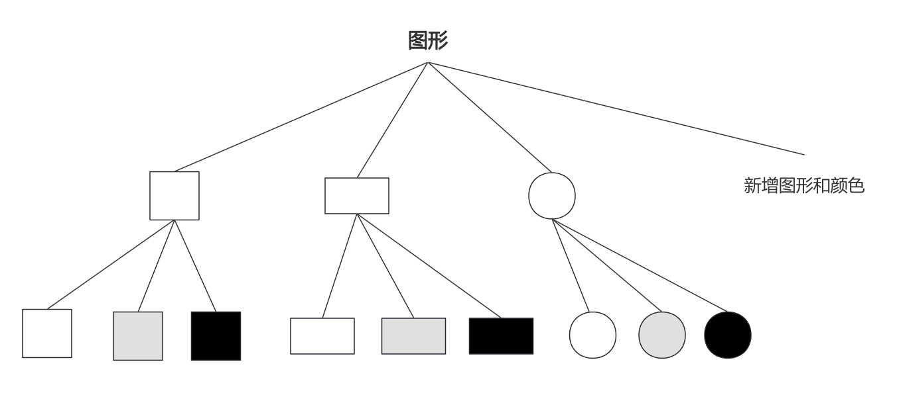
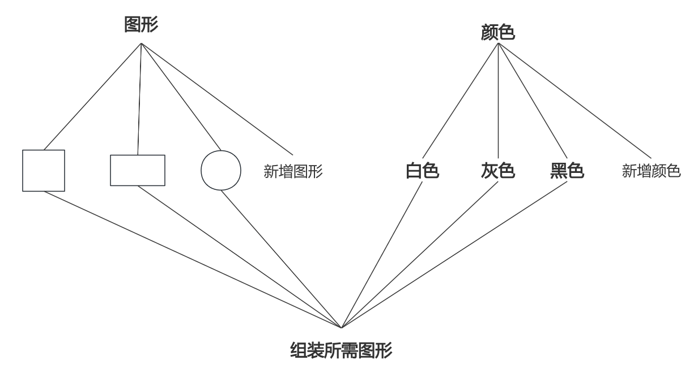
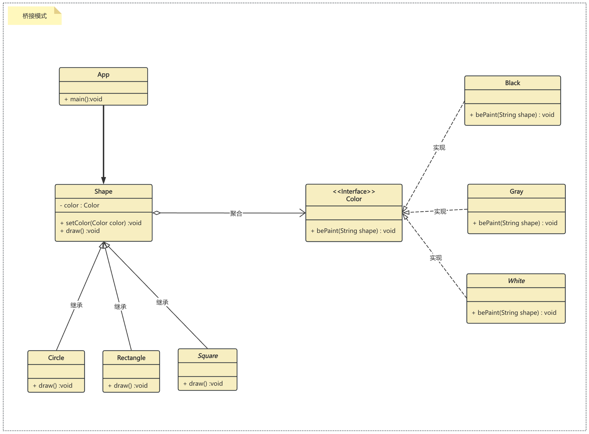

## 桥接模式

在开始学 java 的时候老师讲到继承的时候，总是喜欢用一个例子来讲解，那就是画图，这里有一个画笔，可以画正方形、长方形、圆形。 但是现在我们需要给这些形状进行上色，这里有三种颜色：白色、灰色、黑色。这里我们可以画出3*3=9中图形：白色正方形、白色长方形、白色圆形。。。。。。到这里了我们几乎到知道了这里存在两种解决方案：

* 方案一：为每种形状都提供各种颜色的版本。

* 方案二：根据实际需要对颜色和形状进行组合。（桥接模式）

对于有几个变化的维度(形状、颜色)，我们一般采用方案二来实现，这样除了减少系统中的类个数，也利于系统扩展。对于方案二的应用我们称之为桥接模式。

桥接模式将继承关系转化成关联关系，它降低了类与类之间的耦合度，减少了系统中类的数量，也减少了代码量。

### 实现
