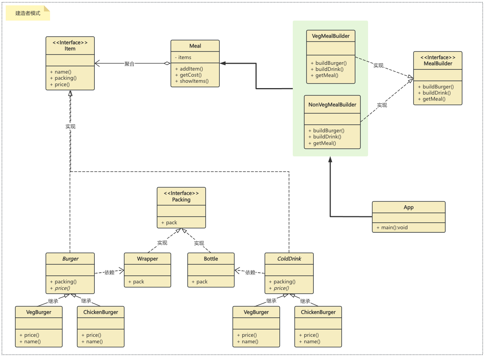

## 建造者模式
建造者模式是一种创建型设计模式，它允许你创建复杂对象的步骤与表示方式相分离。

建造者模式是一种创建型设计模式，它的主要目的是将一个复杂对象的构建过程与其表示相分离，从而可以创建具有不同表示形式的对象。

## 概要
### 意图
将一个复杂的构建过程与其表示相分离，使得同样的构建过程可以创建不同的表示。

### 主要解决
在软件系统中，一个复杂对象的创建通常由多个部分组成，这些部分的组合经常变化，但组合的算法相对稳定。

### 何时使用
当一些基本部件不变，而其组合经常变化时。

### 如何解决
将变与不变的部分分离开。

## 关键代码
* 建造者：创建并提供实例。
* 导演：管理建造出来的实例的依赖关系和控制构建过程。 

## 应用实例
* 去肯德基，汉堡、可乐、薯条、炸鸡翅等是不变的，而其组合是经常变化的，生成出不同的"套餐"。
* Java 中的 StringBuilder。

## 优点
* 分离构建过程和表示，使得构建过程更加灵活，可以构建不同的表示。
* 可以更好地控制构建过程，隐藏具体构建细节。
* 代码复用性高，可以在不同的构建过程中重复使用相同的建造者。

## 缺点
* 如果产品的属性较少，建造者模式可能会导致代码冗余。
* 增加了系统的类和对象数量。

## 使用场景
需要生成的对象具有复杂的内部结构。
需要生成的对象内部属性相互依赖。

## 注意事项
与工厂模式的区别是：建造者模式更加关注于零件装配的顺序。

## 结构
建造者模式包含以下几个主要角色：

* 产品（Product）：要构建的复杂对象。产品类通常包含多个部分或属性。
* 抽象建造者（Builder）：定义了构建产品的抽象接口，包括构建产品的各个部分的方法。
* 具体建造者（Concrete Builder）：实现抽象建造者接口，具体确定如何构建产品的各个部分，并负责返回最终构建的产品。
* 指导者（Director）：负责调用建造者的方法来构建产品，指导者并不了解具体的构建过程，只关心产品的构建顺序和方式。

