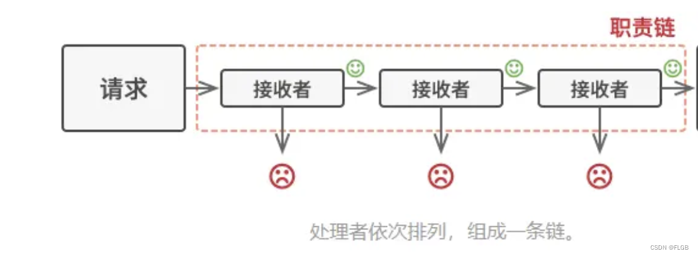
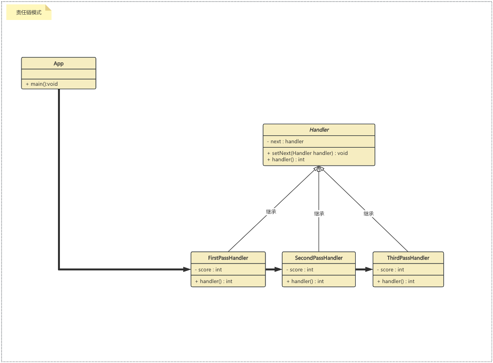

## 责任链模式
一种行为型设计模式，它用于将请求的发送者和接收者解耦，使多个对象都有机会处理请求。这种模式建立在一个处理对象的链上，每个处理对象都可以选择处理请求或者将请求传递给链上的下一个处理对象。

## 要素：
**抽象处理者（Handler）**：定义一个处理请求的接口，通常包括一个处理方法（例如：handleRequest()）和一个设置下一个处理者的方法（例如：setNextHandler()）。抽象处理者可以是一个接口或者抽象类。

**具体处理者（ConcreteHandler）**：实现抽象处理者接口，具体处理不同的请求。如果当前处理者无法处理请求，它可以将请求传递给下一个处理者。

**责任链（Chain ofResponsibility）**：将一系列的处理者连接成一个链，形成处理请求的链式结构。通常在客户端代码中构建这个责任链，并将请求从链的开头传递给第一个处理者。

## 使用场景
**日志记录系统**：在系统中实现日志记录功能时，可以使用责任链模式。不同的日志级别（如调试、信息、警告、错误）可以由不同的处理器来处理，从而根据需要将日志记录到不同的目标（文件、数据库、控制台等）。

**审批流程**：在企业应用中，审批流程可能涉及多个层级的审批，每个层级的审批者都可以决定是否通过审批。责任链模式可以用于构建这样的审批流程，其中每个处理器代表一个审批者，如果一个审批者无法处理，请求将传递给下一个审批者。

**安全认证**：在安全认证中，可以使用责任链模式来实现多层级的认证机制。每个认证处理器可以负责一个特定的认证方法（如用户名密码、指纹、令牌等）。如果一个认证处理器无法通过认证，系统可以继续尝试下一个处理器。

**HTTP 请求处理**：在 Web 应用程序中，HTTP 请求处理可以分成多个环节，例如身份验证、授权、输入验证、缓存等。责任链模式可以用于将每个环节拆分成一个处理器，并将请求从一个处理器传递到下一个处理器。

**异常处理链**：在处理异常时，可能需要一系列处理步骤来处理不同类型的异常。责任链模式可以用于将异常处理逻辑分解成多个处理器，每个处理器负责处理一种类型的异常。

**请求过滤器**：在 Web 开发中，请求过滤器可以用于对请求进行预处理，例如请求参数验证、安全检查等。责任链模式可以用于将不同的过滤逻辑拆分成多个处理器，依次对请求进行处理。

**游戏闯关系统**：在游戏中，角色的闯关系统可以采用责任链模式。每层关卡可以由不同的处理器来处理，如果一个处理器处理完成当前关卡，结果打到过关条件，系统可以使用下一个处理器进行下一关处理。

