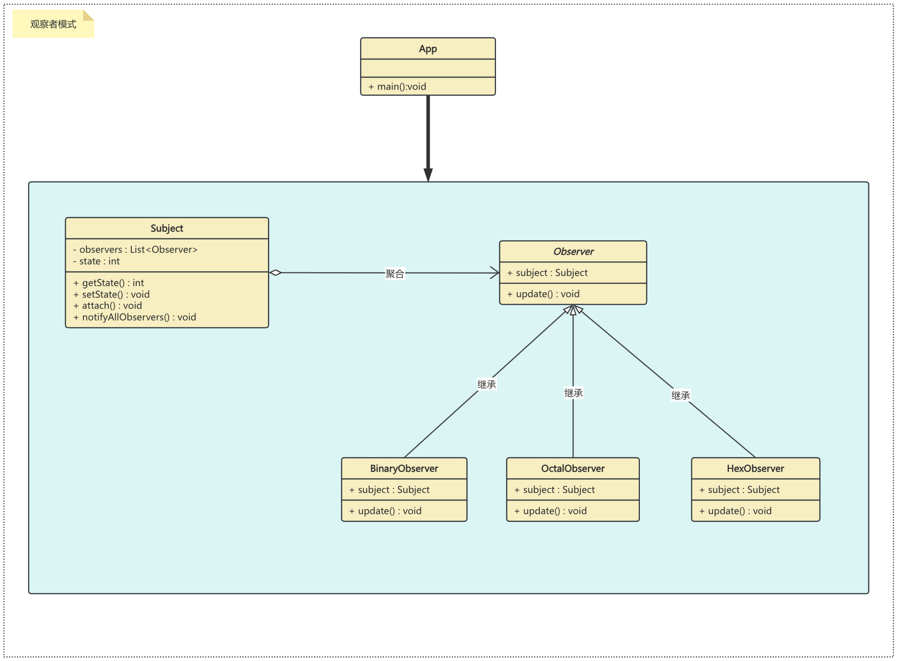

## 观察者模式
当对象间存在一对多关系时，则使用观察者模式（Observer Pattern）。比如，当一个对象被修改时，则会自动通知依赖它的对象。观察者模式属于行为型模式。

## 实现方式
* 定义观察者接口：包含一个更新方法。
* 创建具体观察者：实现观察者接口，定义接收到通知时的行为。
* 定义主题接口：包含添加、删除和通知观察者的方法。
* 创建具体主题：实现主题接口，管理观察者列表，并在状态改变时通知它们。

## 实现
